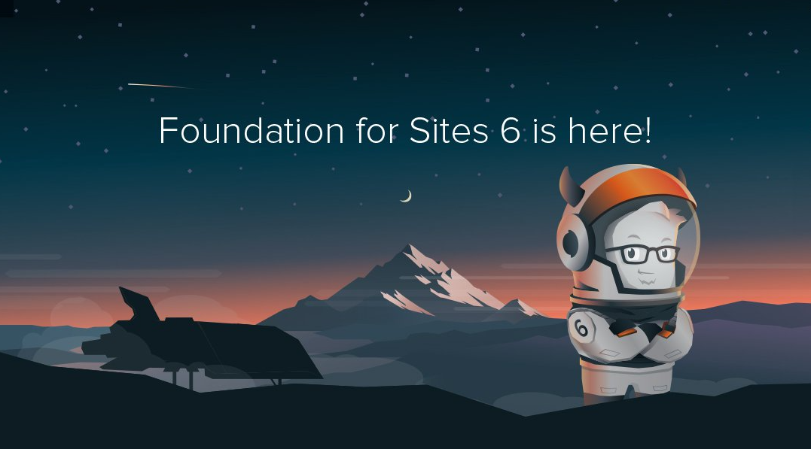

# Framework Foundation v6 study

> This project seeks to learn the Framework Foundation in its version 6

Framework Foundation v6 study
This project seeks to learn the Framework Foundation in its version 6

## Built With

- Foundation 6
- HTML5
- CSS3
- Git
- Github
- Lintern
- VSCode

## Live Demo

[Live Demo Link](https://aristides1000.github.io/Framework-Foundation-v6-study/)

## Getting Started

This project was created with the purpose of studying the Framework Foundation in its version 6 and seeing its practical applications today.

### Prerequisites

Computer running Mac OS, Windows, or Linux Ubuntu. Internet browser: Firefox, Google Chrome, Opera...

### Install

Download the code or copy the git repository to your computer.

### Usage
Run the different Html files in your browser to find out how they work.

### Run tests
Linters errors

## Authors

👤 **Author**
Aristides Jose Molina Pérez

- GitHub: [@aristides1000](https://github.com/aristides1000)
- Twitter: [@aristides_1000](https://twitter.com/@aristides_1000)
- LinkedIn: [aristides jose molina perez](https://www.linkedin.com/in/aristides-jose-molina-perez-09b0579a)

## 🤝 Contributing

Contributions, issues, and feature requests are welcome!

Feel free to check the [issues page](https://github.com/aristides1000/Framework-Foundation-v6-study/issues).

## Show your support

Give a ⭐️ if you like this project!

## Acknowledgments

Ariel Camus CEO Microverse: For letting us start this journey
Google: For letting us find crucial information in order to create this project
